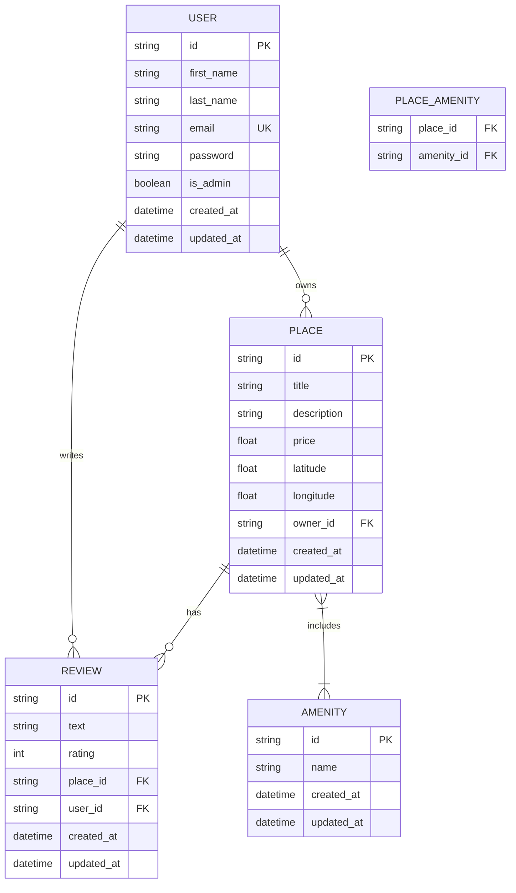

# Database Entity-Relationship Diagram

```mermaid
erDiagram
    USER ||--o{ PLACE : "owns"
    USER ||--o{ REVIEW : "writes"
    PLACE ||--o{ REVIEW : "has"
    PLACE }|--|{ AMENITY : "includes"

    USER {
        string id PK
        string first_name
        string last_name
        string email UK
        string password
        boolean is_admin
        datetime created_at
        datetime updated_at
    }

    PLACE {
        string id PK
        string title
        string description
        float price
        float latitude
        float longitude
        string owner_id FK
        datetime created_at
        datetime updated_at
    }

    REVIEW {
        string id PK
        string text
        int rating
        string place_id FK
        string user_id FK
        datetime created_at
        datetime updated_at
    }

    AMENITY {
        string id PK
        string name
        datetime created_at
        datetime updated_at
    }

    PLACE_AMENITY {
        string place_id FK
        string amenity_id FK
    }
```
